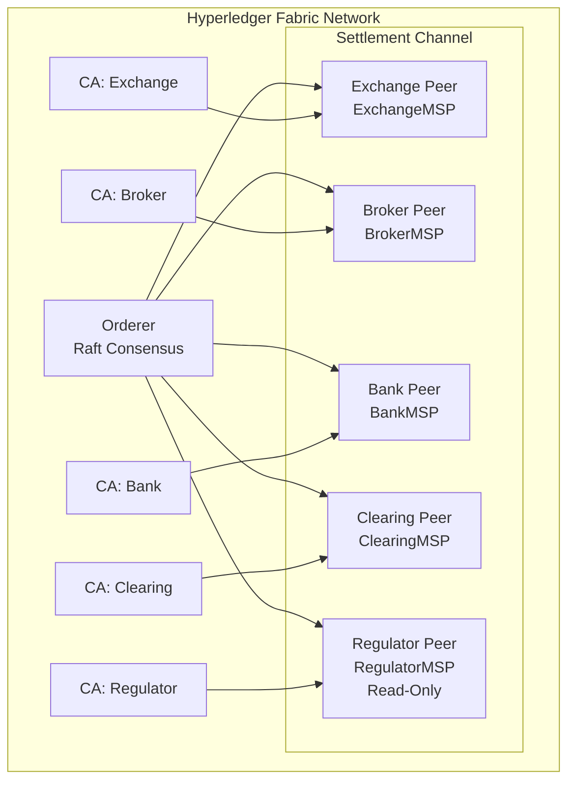
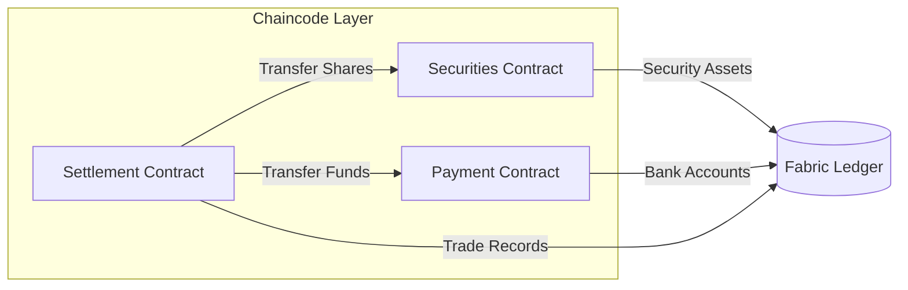

# Architecture - Real-Time Settlement Blockchain

## Overview

This system implements a blockchain-based settlement layer for Indian stock markets using Hyperledger Fabric. It replaces the traditional T+1 settlement cycle with **real-time atomic settlement in 2–10 seconds**.

## Network Topology

## Participants

| Participant            | MSP ID         | Role                                    | Port  |
|------------------------|----------------|-----------------------------------------|-------|
| Exchange               | ExchangeMSP    | Submits trades, endorses settlements    | 7051  |
| Broker                 | BrokerMSP      | Represents buy/sell parties             | 8051  |
| Bank                   | BankMSP        | Manages cash settlement accounts        | 9051  |
| Clearing Corporation   | ClearingMSP    | Validates clearing obligations          | 10051 |
| Regulator              | RegulatorMSP   | Read-only audit and compliance          | 11051 |

## Smart Contract Architecture

### Securities Contract
Manages equity ownership records. Stores `SecurityAsset` objects keyed by `{Symbol}_{Owner}`.

**Functions:** `CreateSecurity`, `IssueShares`, `TransferShares`, `QuerySecurityOwner`, `GetShares`

### Payment Contract
Manages settlement cash accounts. Stores `BankAccount` objects keyed by account ID.

**Functions:** `CreateAccount`, `CreditAccount`, `DebitAccount`, `TransferFunds`, `QueryBalance`, `GetBalance`

### Settlement Contract (Atomic DvP)
Orchestrates simultaneous securities and cash transfer in a single atomic Fabric transaction.

**Core Function:** `AtomicSettlement(tradeID, buyer, seller, symbol, qty, price)`

## Technology Stack

| Component          | Technology              |
|--------------------|-------------------------|
| Blockchain         | Hyperledger Fabric 2.5  |
| Consensus          | Raft (etcdraft)         |
| Smart Contracts    | Go (contractapi)        |
| State Database     | CouchDB 3.3            |
| Client SDK         | Node.js (fabric-network)|
| Containerization   | Docker Compose          |
| Certificate Auth   | Fabric CA 1.5           |

## Security Model

- **Permissioned Network:** All participants are identified via X.509 certificates
- **MSP (Membership Service Provider):** Each organization has its own CA and MSP
- **TLS:** All communication is encrypted with TLS
- **Endorsement Policy:** Majority of organizations must endorse transactions
- **Regulator Access:** Read-only access for audit without write permissions
- **Atomic Transactions:** DvP settlement is atomic — both legs succeed or both fail
