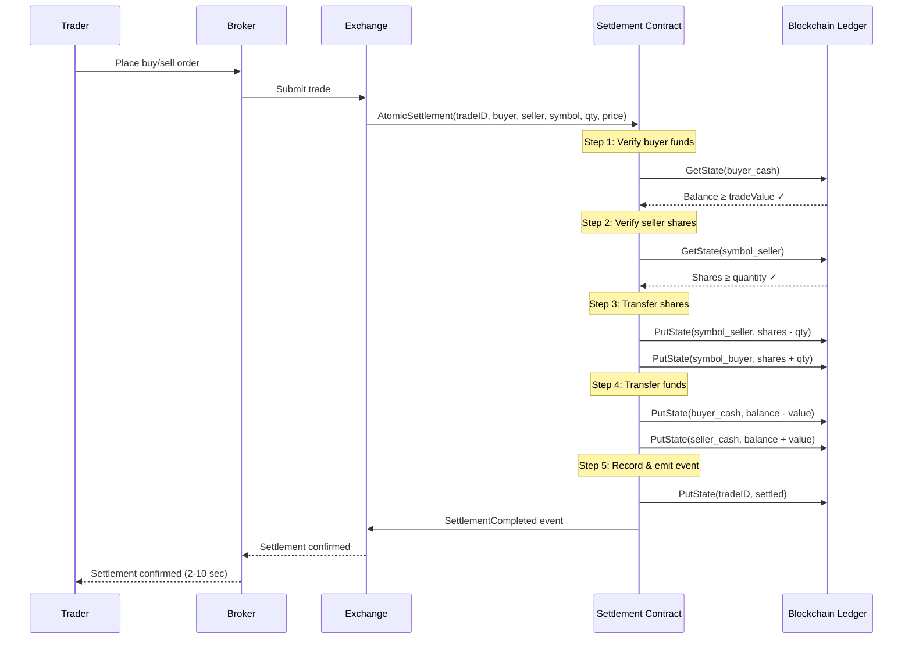

# Settlement Flow - Delivery versus Payment (DvP)

## Overview

This document describes the end-to-end flow of a trade from submission to atomic settlement on the blockchain.

## Trade-to-Settlement Flow



## Atomic Settlement Logic

```
AtomicSettlement(tradeID, buyer, seller, symbol, qty, price):

    tradeValue = qty × price

    // Verification phase
    IF buyer.balance < tradeValue → FAIL (insufficient funds)
    IF seller.shares < qty       → FAIL (insufficient shares)

    // Execution phase (atomic within Fabric transaction)
    seller.shares  -= qty
    buyer.shares   += qty
    buyer.balance  -= tradeValue
    seller.balance += tradeValue

    // Recording phase
    trade.status = "settled"
    EMIT SettlementCompleted(tradeID)
```

> **Key Guarantee:** Because all state mutations occur within a single Fabric transaction, either ALL changes commit or NONE do. This is the atomic DvP guarantee.

## Data Model

### SecurityAsset
```json
{
    "docType": "securityAsset",
    "id": "RELIANCE_brokerA",
    "symbol": "RELIANCE",
    "owner": "brokerA",
    "quantity": 100
}
```

### BankAccount
```json
{
    "docType": "bankAccount",
    "accountID": "brokerA_cash",
    "owner": "brokerA",
    "balance": 500000
}
```

### TradeRecord
```json
{
    "docType": "tradeRecord",
    "tradeID": "TX001",
    "buyer": "brokerA",
    "seller": "brokerB",
    "symbol": "RELIANCE",
    "quantity": 100,
    "price": 2500,
    "tradeValue": 250000,
    "status": "settled",
    "settledAt": "2026-03-10T09:30:00Z",
    "failureReason": ""
}
```

## Demo Scenario

### Initial State

| Party   | Cash Balance | RELIANCE Shares |
|---------|-------------|-----------------|
| BrokerA | ₹500,000    | 0               |
| BrokerB | ₹0          | 100             |

### Trade

BrokerA buys 100 RELIANCE shares from BrokerB at ₹2,500 per share.

- Trade Value: 100 × ₹2,500 = **₹250,000**

### Post-Settlement State

| Party   | Cash Balance | RELIANCE Shares |
|---------|-------------|-----------------|
| BrokerA | ₹250,000    | 100             |
| BrokerB | ₹250,000    | 0               |

**Settlement Time: 2–10 seconds** (vs T+1 in traditional markets)

## Failure Scenarios

| Scenario               | Behavior                                  |
|------------------------|-------------------------------------------|
| Insufficient funds     | Trade recorded as "failed", no state change |
| Insufficient shares    | Trade recorded as "failed", no state change |
| Duplicate trade ID     | Rejected with error                        |
| Network partition      | Raft consensus ensures consistency         |
| Invalid input          | Rejected at validation step                |

## Events

The settlement contract emits two event types:

- **SettlementCompleted** — Trade settled successfully
- **SettlementFailed** — Trade failed validation

Client applications can subscribe to these events for real-time notifications.
